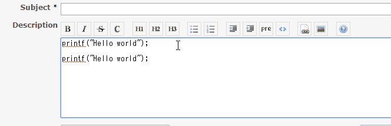

# Redmine GitHub Style Fenced Code Block Plugin

This is Redmine plugin. This plugin changes fenced code block ` ~~~ ` to `` ``` ``.



## Installation

1. Clone or copy files into the Redmine plugins directory
   ```
   git clone https://github.com/taikii/redmine_github_style_fenced_code_block.git plugins/redmine_github_style_fenced_code_block
   ```
2. Restart Redmine

## License

[MIT](LICENSE)
